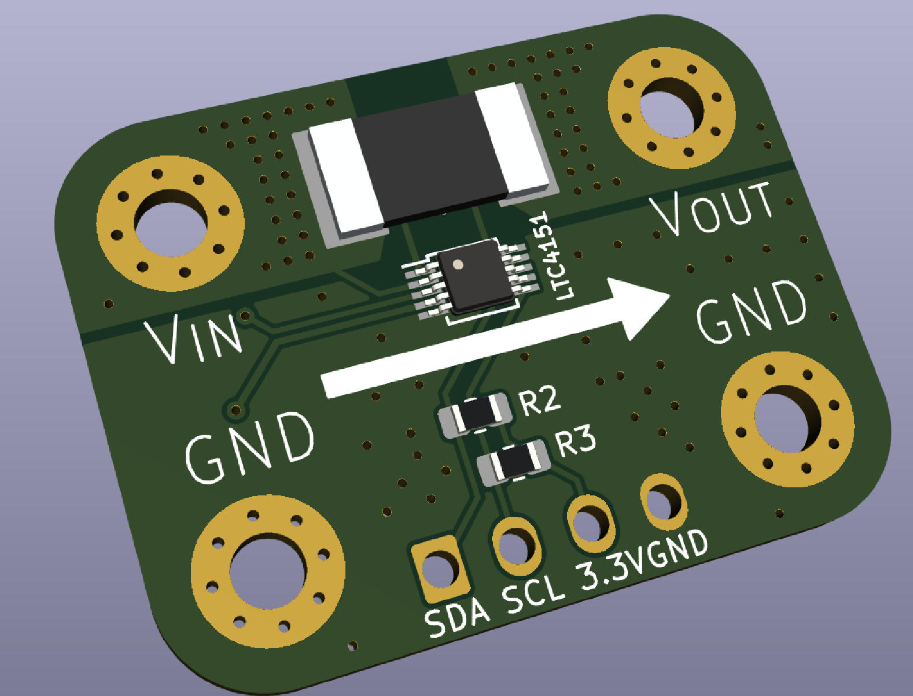

# Current and Voltage Sensor
*KiCAD project for a Current and Voltage sensor PCB*

This sensor is based around the LTC4151 current and voltage monitor

By deafult a 1.5 mOhm shunt is used, providing a maximum measurable current of 54 A. The voltage range is 7-80 V.  

## Schematic

